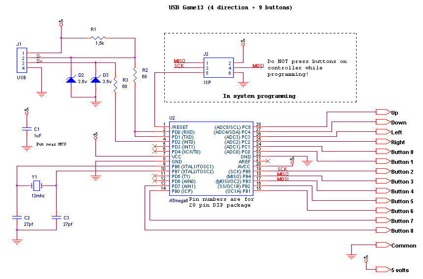

# 9-buttons-arcade-controller
Firmware for a homemade 9 buttons controller using an ATmega8
##Components needed
* **U2**: Atmega8 microcontroller.
* **R1**: 1.5k resistor. Ordinary carbon film 1/4 watt resistors will do.
* **R2, R3**: 68 ohm resistors. Ordinary carbon film 1/4 watt resistors will do.
* **D2, D33**: 3.6 volts zener diodes.
* **Y13**: 12 Mhz crystal.
* **C2, C33**: 27 pf capacitors. If the crystal datasheet recommends another value, use it instead.
* **C13**: 10uf capacitor. Install it near the ATmega8.
* **J23**: 6 pin header, 2.54mm spacing. Needed for programming the ATmega8.
##Diagram
